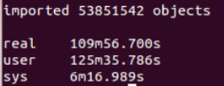
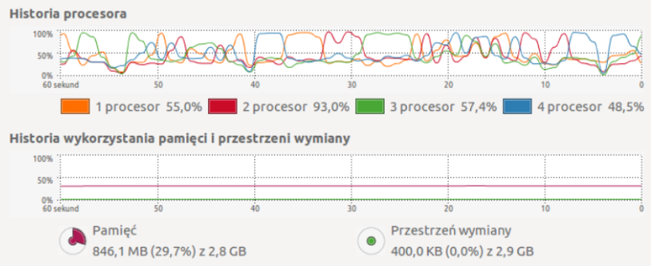
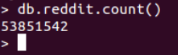

###Zadanie 1a

#####Import pliku RC_2015-01 do bazy MongoDB

Zaimportowałam plik korzystając z poniższej komendy:
```sh
time bunzip2 -c RC_2015-01.bz2 | mongoimport --drop --host 127.0.0.1 -d test -c reddit
```


Historia Procesora:



Procesory były obciążane równomiernie od 25 do 95 procent. Pamięć była wykorzystywana od 28 do 31 procent.

Połączyłam się z mongo, przeszłam do bazy testi wybrałam kolekcję reddit:
```sh
mongo
MongoDB shell version: 2.6.3
connecting to: test
> show dbs
local	0.203125GB
test	37.935546875GB
> use test
switched to db test
> show collections
reddit
system.indexes
```
Policzyłam wszystkie jsony:



Przykładowe zapytania:
* znajdź pierwsze:
```sh
> db.reddit.findOne()
{
	"_id" : ObjectId("5657848cc40dd605ebeb4d7d"),
	"score_hidden" : false,
	"name" : "t1_cnas8zv",
	"link_id" : "t3_2qyr1a",
	"body" : "Most of us have some family members like this. *Most* of my family is like this. ",
	"downs" : 0,
	"created_utc" : "1420070400",
	"score" : 14,
	"author" : "YoungModern",
	"distinguished" : null,
	"id" : "cnas8zv",
	"archived" : false,
	"parent_id" : "t3_2qyr1a",
	"subreddit" : "exmormon",
	"author_flair_css_class" : null,
	"author_flair_text" : null,
	"gilded" : 0,
	"retrieved_on" : 1425124282,
	"ups" : 14,
	"controversiality" : 0,
	"subreddit_id" : "t5_2r0gj",
	"edited" : false
}
> 
```
* znajdź ostatnie:
```sh
> db.reddit.findOne( {$query:{}, $orderby:{$natural:-1}} )
{
	"_id" : ObjectId("56579d9ec40dd605eb210312"),
	"author_flair_text" : "RRRAURGH!",
	"gilded" : 0,
	"score_hidden" : false,
	"id" : "co77gzt",
	"parent_id" : "t1_co6zqmw",
	"distinguished" : null,
	"ups" : 3,
	"downs" : 0,
	"created_utc" : "1422748799",
	"name" : "t1_co77gzt",
	"body" : "You can already shoot through walls without Shred.",
	"author_flair_css_class" : "valkyr-bastet",
	"subreddit_id" : "t5_2urg0",
	"link_id" : "t3_2uazsm",
	"controversiality" : 0,
	"edited" : false,
	"retrieved_on" : 1424281770,
	"author" : "blolfighter",
	"subreddit" : "Warframe",
	"archived" : false,
	"score" : 3
}
> 
```
* wyświetlenie postów z liczbą polubień ponad 6000 ("ups") - największy wynik:
```sh
db.reddit.find({ups: { $gte: 6000}})
{
  "_id": ObjectId("5658425432e70c909f1267a7"),
  "parent_id": "t3_2s9u0s",
  "body": "I can answer this one.  For some reason, I attract these people into my life. [...] Nobody has it all. Nobody.",
  "controversiality": 0,
  "author_flair_css_class": null,
  "edited": 1421720564,
  "author_flair_text": null,
  "downs": 0,
  "retrieved_on": 1424900621,
  "name": "t1_cnnmca8",
  "subreddit": "AskReddit",
  "distinguished": null,
  "archived": false,
  "score": 6597,
  "link_id": "t3_2s9u0s",
  "score_hidden": false,
  "subreddit_id": "t5_2qh1i",
  "id": "cnnmca8",
  "created_utc": "1421163921",
  "gilded": 9,
  "author": "a1988eli",
  "ups": 6597
}
Fetched 3 record(s) in 646239ms
```
* wyświetlenie 5 autorów wpisów nagrodzonych "złotem" siedmio- i ośmiokrotnie:
```sh
db.reddit.find({gilded : {$in: [7, 8]}},{_id:0, author:1, gilded:1}).limit(5)
db.reddit.find({gilded : {$in: [7, 8]}},{_id:0, author:1, gilded:1}).limit(5)
{
  "author": "Xarasystral",
  "gilded": 7
}
{
  "gilded": 8,
  "author": "coughdropz"
}
{
  "gilded": 7,
  "author": "lalaland40000"
}
{
  "author": "IMoustacheYou",
  "gilded": 7
}
{
  "author": "desmunda1",
  "gilded": 7
}
Fetched 5 record(s) in 453257ms
```

###Zadanie 2

#####Import pliku orlen.json do bazy MongoDB

Zaimportowałam plik orlen.json korzystając z poniższej komendy:
```sh
time mongoimport -d orlen -c stacje < orlen.json
```
Czas importowania pliku:
```sh
imported 1245 objects

real	0m0.572s
user	0m0.088s
sys	0m0.088s
```
Dodałam geoindeks do kolekcji stacje:
```sh
db.stacje.ensureIndex({loc : "2dsphere"})
{
	"createdCollectionAutomatically" : false,
	"numIndexesBefore" : 1,
	"numIndexesAfter" : 2,
	"ok" : 1
}
```
Dodałam przykładowe zapytania:

*znajdź pierwsze
```sh
> db.stacje.findOne()
{
	"_id" : ObjectId("56587fb9d3d1ab580a563180"),
	"loc" : {
		"type" : "Point",
		"coordinates" : [
			20.021194,
			49.453218
		]
	},
	"name" : "Stacje paliw Orlen",
	"city" : "Nowy Targ"
}
```
* znajdź stacje Orlen oddalone od Władysławowa o maksymalnie o 25km:
```sh
> db.stacje.find({loc: {$near: {$geometry: {type: "Point", coordinates: [18.405400,54.775920]}, $maxDistance: 25000}}}).skip(1)
{ "_id" : ObjectId("56587fbad3d1ab580a56352d"), "loc" : { "type" : "Point", "coordinates" : [ 18.40589, 54.71592 ] }, "name" : "Stacje paliw Orlen", "city" : "Puck" }
{ "_id" : ObjectId("56587fbad3d1ab580a5634a4"), "loc" : { "type" : "Point", "coordinates" : [ 18.1183, 54.78674 ] }, "name" : "Stacje paliw Orlen", "city" : "Odargowo" }
{ "_id" : ObjectId("56587fbad3d1ab580a563614"), "loc" : { "type" : "Point", "coordinates" : [ 18.27235, 54.60235 ] }, "name" : "Stacje paliw Orlen", "city" : "Wejherowo" }
{ "_id" : ObjectId("56587fbad3d1ab580a563332"), "loc" : { "type" : "Point", "coordinates" : [ 18.37933, 54.57634 ] }, "name" : "Stacje paliw Orlen", "city" : "Rumia" }
{ "_id" : ObjectId("56587fbad3d1ab580a5633fc"), "loc" : { "type" : "Point", "coordinates" : [ 18.18959, 54.61076 ] }, "name" : "Stacje paliw Orlen", "city" : "Wejherowo" }
{ "_id" : ObjectId("56587fbad3d1ab580a563327"), "loc" : { "type" : "Point", "coordinates" : [ 18.42266, 54.56018 ] }, "name" : "Stacje paliw Orlen", "city" : "Rumia" }
> 
```
