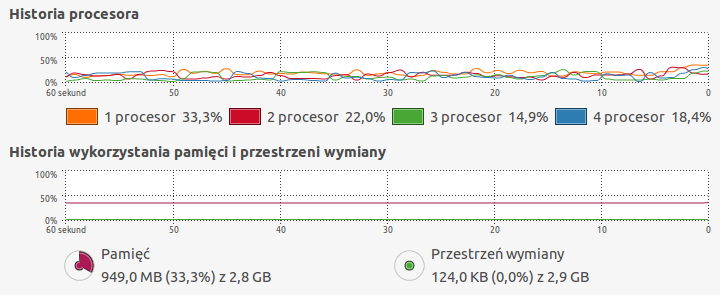

###Zadanie 1a MongoDB

#####Import pliku RC_2015-01 do bazy MongoDB

Zaimportowałam plik korzystając z poniższej komendy:
```sh
time bunzip2 -c RC_2015-01.bz2 | mongoimport --drop --host 127.0.0.1 -d test -c reddit
```


Historia Procesora:


Procesory były obciążone równomiernie od 25 do 95 procent. Pamięć była wykorzystywana od 28 do 31 procent.

Połączyłam się z mongo, przeszłam do bazy testy i wybrałam kolekcję reddit:
```sh
mongo
MongoDB shell version: 2.6.3
connecting to: test
> show dbs
local	0.203125GB
test	37.935546875GB
> use test
switched to db test
> show collections
reddit
system.indexes
```
Policzyłam wszystkie jsony:


##### Dodałam przykładowe zapytania:

* znajdź pierwszy:
```sh
> db.reddit.findOne()
{
	"_id" : ObjectId("5657848cc40dd605ebeb4d7d"),
	"score_hidden" : false,
	"name" : "t1_cnas8zv",
	"link_id" : "t3_2qyr1a",
	"body" : "Most of us have some family members like this. *Most* of my family is like this. ",
	"downs" : 0,
	"created_utc" : "1420070400",
	"score" : 14,
	"author" : "YoungModern",
	"distinguished" : null,
	"id" : "cnas8zv",
	"archived" : false,
	"parent_id" : "t3_2qyr1a",
	"subreddit" : "exmormon",
	"author_flair_css_class" : null,
	"author_flair_text" : null,
	"gilded" : 0,
	"retrieved_on" : 1425124282,
	"ups" : 14,
	"controversiality" : 0,
	"subreddit_id" : "t5_2r0gj",
	"edited" : false
}
> 
```
* znajdź ostatni:
```sh
> db.reddit.findOne( {$query:{}, $orderby:{$natural:-1}} )
{
	"_id" : ObjectId("56579d9ec40dd605eb210312"),
	"author_flair_text" : "RRRAURGH!",
	"gilded" : 0,
	"score_hidden" : false,
	"id" : "co77gzt",
	"parent_id" : "t1_co6zqmw",
	"distinguished" : null,
	"ups" : 3,
	"downs" : 0,
	"created_utc" : "1422748799",
	"name" : "t1_co77gzt",
	"body" : "You can already shoot through walls without Shred.",
	"author_flair_css_class" : "valkyr-bastet",
	"subreddit_id" : "t5_2urg0",
	"link_id" : "t3_2uazsm",
	"controversiality" : 0,
	"edited" : false,
	"retrieved_on" : 1424281770,
	"author" : "blolfighter",
	"subreddit" : "Warframe",
	"archived" : false,
	"score" : 3
}
> 
```
* wyświetlenie wpisów z liczbą polubień ponad 6000 ("ups") - największy wynik:
```sh
db.reddit.find({ups: { $gte: 6000}})
{
  "_id": ObjectId("5658425432e70c909f1267a7"),
  "parent_id": "t3_2s9u0s",
  "body": "I can answer this one.  For some reason, I attract these people into my life. [...] Nobody has it all. Nobody.",
  "controversiality": 0,
  "author_flair_css_class": null,
  "edited": 1421720564,
  "author_flair_text": null,
  "downs": 0,
  "retrieved_on": 1424900621,
  "name": "t1_cnnmca8",
  "subreddit": "AskReddit",
  "distinguished": null,
  "archived": false,
  "score": 6597,
  "link_id": "t3_2s9u0s",
  "score_hidden": false,
  "subreddit_id": "t5_2qh1i",
  "id": "cnnmca8",
  "created_utc": "1421163921",
  "gilded": 9,
  "author": "a1988eli",
  "ups": 6597
}
Fetched 3 record(s) in 646239ms
```
* wyświetlenie 5 autorów wpisów nagrodzonych "złotem" siedmio- i ośmiokrotnie:
```sh
db.reddit.find({gilded : {$in: [7, 8]}},{_id:0, author:1, gilded:1}).limit(5)
db.reddit.find({gilded : {$in: [7, 8]}},{_id:0, author:1, gilded:1}).limit(5)
{
  "author": "Xarasystral",
  "gilded": 7
}
{
  "gilded": 8,
  "author": "coughdropz"
}
{
  "gilded": 7,
  "author": "lalaland40000"
}
{
  "author": "IMoustacheYou",
  "gilded": 7
}
{
  "author": "desmunda1",
  "gilded": 7
}
Fetched 5 record(s) in 453257ms
```
* wyświetlenie 5 pierwszych wpisów autora "coughdropz":
```sh
db.reddit.find({author: "coughdropz"}, {_id:0, author:1, body:1}).limit(5)
{
  "body": "Expecting a big game from Nico Suave tonight!"
}
{
  "body": "I got downvoted to hell for calling this guy a joke.  He's going to be demanding a starting position for the Bejing Ducks or some shit if he's not careful."
}
{
  "body": "I backed it up!  Don't judge downvotes from a post you never read.  "
}
{
  "body": "It has very little to do with his skill as an athlete and more to do with his negative basketball IQ, terrible shot selection, and HILARIOUSLY stupid comments to the media.  Get off your high horse, the guy who's shooting 28% from 3 while still jacking them up, talks shit about dread locks while sitting 10 feet from a teammate with dread locks, and gets WAIVED because he's such a fool the Pistons would rather pay him to play for someone else is a JOKE.  Not to mention he then demands a starting role instead of working to rehab his career.  Why do we have to play pretend for the sake of Josh Smith's feelings?  If you hurt your team, get waived, demand a starting role, and promptly shit the bed, you're a joke.\n\n"
}
{
  "body": "He started it.  I have dread locks!"
}
Fetched 5 record(s) in 60668ms
```
Historia procesora podczas wyszukiwania wpisów autora "coughdropz":



###Zadanie 1b Postgres (w przygotowaniu)

###Zadanie 2 GeoJSON (pliki .geojson w przygotowaniu)

#####Import pliku orlen.json do bazy MongoDB

Zaimportowałam plik orlen.json korzystając z poniższej komendy:
```sh
time mongoimport -d orlen -c stacje < orlen.json
```
Czas importowania pliku:
```sh
imported 1245 objects

real	0m0.572s
user	0m0.088s
sys	0m0.088s
```
Dodałam geoindeks do kolekcji stacje:
```sh
db.stacje.ensureIndex({loc : "2dsphere"})
{
	"createdCollectionAutomatically" : false,
	"numIndexesBefore" : 1,
	"numIndexesAfter" : 2,
	"ok" : 1
}
```
##### Dodałam przykładowe zapytania:

* znajdź pierwsze
```sh
> db.stacje.findOne()
{
	"_id" : ObjectId("56587fb9d3d1ab580a563180"),
	"loc" : {
		"type" : "Point",
		"coordinates" : [
			20.021194,
			49.453218
		]
	},
	"name" : "Stacje paliw Orlen",
	"city" : "Nowy Targ"
}
```
* znajdź stacje Orlen oddalone od Władysławowa o maksymalnie o 25km:
```sh
> db.stacje.find({loc: {$near: {$geometry: {type: "Point", coordinates: [18.405400,54.775920]}, $maxDistance: 25000}}}).skip(1)
{ "_id" : ObjectId("56587fbad3d1ab580a56352d"), "loc" : { "type" : "Point", "coordinates" : [ 18.40589, 54.71592 ] }, "name" : "Stacje paliw Orlen", "city" : "Puck" }
{ "_id" : ObjectId("56587fbad3d1ab580a5634a4"), "loc" : { "type" : "Point", "coordinates" : [ 18.1183, 54.78674 ] }, "name" : "Stacje paliw Orlen", "city" : "Odargowo" }
{ "_id" : ObjectId("56587fbad3d1ab580a563614"), "loc" : { "type" : "Point", "coordinates" : [ 18.27235, 54.60235 ] }, "name" : "Stacje paliw Orlen", "city" : "Wejherowo" }
{ "_id" : ObjectId("56587fbad3d1ab580a563332"), "loc" : { "type" : "Point", "coordinates" : [ 18.37933, 54.57634 ] }, "name" : "Stacje paliw Orlen", "city" : "Rumia" }
{ "_id" : ObjectId("56587fbad3d1ab580a5633fc"), "loc" : { "type" : "Point", "coordinates" : [ 18.18959, 54.61076 ] }, "name" : "Stacje paliw Orlen", "city" : "Wejherowo" }
{ "_id" : ObjectId("56587fbad3d1ab580a563327"), "loc" : { "type" : "Point", "coordinates" : [ 18.42266, 54.56018 ] }, "name" : "Stacje paliw Orlen", "city" : "Rumia" }
```
* znajdź stacje na linii Gdańsk - Szczecin:
```sh
> db.stacje.find({loc: {$geoIntersects: {$geometry: {type: "LineString", coordinates: [ [18.477135,54.380675], [14.570300,53.442940]]}}}})
{ "_id" : ObjectId("56587fbad3d1ab580a56329a"), "loc" : { "type" : "Point", "coordinates" : [ 18.477135, 54.380675 ] }, "name" : "Stacje paliw Orlen", "city" : "Gdańsk" }
{ "_id" : ObjectId("56587fbad3d1ab580a56337c"), "loc" : { "type" : "Point", "coordinates" : [ 14.5703, 53.44294 ] }, "name" : "Stacje paliw Orlen", "city" : "Szczecin" }
```
* znajdź stacje w Pucku i najbliższych 3 miastach:
```sh
> db.stacje.find({loc: {$near: {$geometry: {type: "Point", coordinates: [18.405890,54.715920]}}}}).limit(3)
{ "_id" : ObjectId("56587fbad3d1ab580a56352d"), "loc" : { "type" : "Point", "coordinates" : [ 18.40589, 54.71592 ] }, "name" : "Stacje paliw Orlen", "city" : "Puck" }
{ "_id" : ObjectId("56587fbad3d1ab580a563490"), "loc" : { "type" : "Point", "coordinates" : [ 18.4054, 54.77592 ] }, "name" : "Stacje paliw Orlen", "city" : "Władysławowo" }
{ "_id" : ObjectId("56587fbad3d1ab580a563614"), "loc" : { "type" : "Point", "coordinates" : [ 18.27235, 54.60235 ] }, "name" : "Stacje paliw Orlen", "city" : "Wejherowo" }
```
* znajdź stacje na terenie województwa pomorskiego:
```sh
> db.stacje.find({loc: {$geoWithin: {$geometry: {type: "Polygon", coordinates: [[[16.7431640625,54.57524580078328],[16.853027,54.223496],[16.721191,54.201010],[16.918945,53.761701],[17.023315,53.501117],[17.418823,53.517450],[17.748413,53.657661],[18.160400,53.787671],[18.764648,53.670680],[19.193115,53.563151],[19.363403,53.833080],[19.489746,53.794161],[19.588623,53.946387],[19.220581,54.348552],[18.325195,54.822843],[16.743164,54.575245]]]}}}})
{ "_id" : ObjectId("56587fbad3d1ab580a563555"), "loc" : { "type" : "Point", "coordinates" : [ 18.662809, 54.403565 ] }, "name" : "Stacje paliw Orlen", "city" : "Gdańsk" }
{ "_id" : ObjectId("56587fbad3d1ab580a56348f"), "loc" : { "type" : "Point", "coordinates" : [ 19.11751, 54.32629 ] }, "name" : "Stacje paliw Orlen", "city" : "Stegna" }
{ "_id" : ObjectId("56587fbad3d1ab580a5635f2"), "loc" : { "type" : "Point", "coordinates" : [ 19.10635, 54.21281 ] }, "name" : "Stacje paliw Orlen", "city" : "Nowy Dwór Gdański" }
{ "_id" : ObjectId("56587fbad3d1ab580a56341f"), "loc" : { "type" : "Point", "coordinates" : [ 19.37732, 54.16554 ] }, "name" : "Stacje paliw Orlen", "city" : "Elbląg" }
{ "_id" : ObjectId("56587fbad3d1ab580a563356"), "loc" : { "type" : "Point", "coordinates" : [ 19.01104, 54.03809 ] }, "name" : "Stacje paliw Orlen", "city" : "Malbork" }
{ "_id" : ObjectId("56587fbad3d1ab580a563611"), "loc" : { "type" : "Point", "coordinates" : [ 18.79051, 54.08686 ] }, "name" : "Stacje paliw Orlen", "city" : "Tczew" }
{ "_id" : ObjectId("56587fbad3d1ab580a563646"), "loc" : { "type" : "Point", "coordinates" : [ 18.777407, 54.074322 ] }, "name" : "Stacje paliw Orlen", "city" : "Tczew" }
{ "_id" : ObjectId("56587fbad3d1ab580a563359"), "loc" : { "type" : "Point", "coordinates" : [ 18.68576, 54.17877 ] }, "name" : "Stacje paliw Orlen", "city" : "Pszczółki" }
{ "_id" : ObjectId("56587fbad3d1ab580a5633fb"), "loc" : { "type" : "Point", "coordinates" : [ 18.791383, 54.291775 ] }, "name" : "Stacje paliw Orlen", "city" : "Koszwały" }
{ "_id" : ObjectId("56587fbad3d1ab580a563549"), "loc" : { "type" : "Point", "coordinates" : [ 18.68251, 54.34847 ] }, "name" : "Stacje paliw Orlen", "city" : "Gdańsk" }
{ "_id" : ObjectId("56587fbad3d1ab580a563615"), "loc" : { "type" : "Point", "coordinates" : [ 18.6406, 54.35916 ] }, "name" : "Stacje paliw Orlen", "city" : "Gdańsk" }
{ "_id" : ObjectId("56587fbad3d1ab580a563320"), "loc" : { "type" : "Point", "coordinates" : [ 18.63553, 54.3334 ] }, "name" : "Stacje paliw Orlen", "city" : "Gdańsk" }
{ "_id" : ObjectId("56587fbad3d1ab580a563325"), "loc" : { "type" : "Point", "coordinates" : [ 18.6079, 54.32619 ] }, "name" : "Stacje paliw Orlen", "city" : "Gdańsk" }
{ "_id" : ObjectId("56587fbad3d1ab580a563610"), "loc" : { "type" : "Point", "coordinates" : [ 18.57977, 54.39451 ] }, "name" : "Stacje paliw Orlen", "city" : "Gdańsk" }
{ "_id" : ObjectId("56587fbad3d1ab580a5633fd"), "loc" : { "type" : "Point", "coordinates" : [ 18.52994, 54.17554 ] }, "name" : "Stacje paliw Orlen", "city" : "Trąbki Wielkie" }
{ "_id" : ObjectId("56587fbad3d1ab580a5633fa"), "loc" : { "type" : "Point", "coordinates" : [ 18.2035, 54.24043 ] }, "name" : "Stacje paliw Orlen", "city" : "Egiertowo" }
{ "_id" : ObjectId("56587fbad3d1ab580a5635d9"), "loc" : { "type" : "Point", "coordinates" : [ 18.19589, 54.32905 ] }, "name" : "Stacje paliw Orlen", "city" : "Kartuzy" }
{ "_id" : ObjectId("56587fbad3d1ab580a5635f6"), "loc" : { "type" : "Point", "coordinates" : [ 18.2054, 54.33015 ] }, "name" : "Stacje paliw Orlen", "city" : "Kartuzy" }
{ "_id" : ObjectId("56587fbad3d1ab580a56362d"), "loc" : { "type" : "Point", "coordinates" : [ 18.36004, 54.34226 ] }, "name" : "Stacje paliw Orlen", "city" : "Żukowo" }
{ "_id" : ObjectId("56587fbad3d1ab580a56329a"), "loc" : { "type" : "Point", "coordinates" : [ 18.477135, 54.380675 ] }, "name" : "Stacje paliw Orlen", "city" : "Gdańsk" }
{ "_id" : ObjectId("56587fbad3d1ab580a563334"), "loc" : { "type" : "Point", "coordinates" : [ 18.45373, 54.54153 ] }, "name" : "Stacje paliw Orlen", "city" : "Gdynia" }
{ "_id" : ObjectId("56587fbad3d1ab580a5634ba"), "loc" : { "type" : "Point", "coordinates" : [ 18.42551, 54.55045 ] }, "name" : "Stacje paliw Orlen", "city" : "Gdynia" }
{ "_id" : ObjectId("56587fbad3d1ab580a563327"), "loc" : { "type" : "Point", "coordinates" : [ 18.42266, 54.56018 ] }, "name" : "Stacje paliw Orlen", "city" : "Rumia" }
{ "_id" : ObjectId("56587fbad3d1ab580a563332"), "loc" : { "type" : "Point", "coordinates" : [ 18.37933, 54.57634 ] }, "name" : "Stacje paliw Orlen", "city" : "Rumia" }
{ "_id" : ObjectId("56587fbad3d1ab580a56360f"), "loc" : { "type" : "Point", "coordinates" : [ 18.5335, 54.51339 ] }, "name" : "Stacje paliw Orlen", "city" : "Gdynia" }
{ "_id" : ObjectId("56587fbad3d1ab580a56352d"), "loc" : { "type" : "Point", "coordinates" : [ 18.40589, 54.71592 ] }, "name" : "Stacje paliw Orlen", "city" : "Puck" }
{ "_id" : ObjectId("56587fbad3d1ab580a563490"), "loc" : { "type" : "Point", "coordinates" : [ 18.4054, 54.77592 ] }, "name" : "Stacje paliw Orlen", "city" : "Władysławowo" }
{ "_id" : ObjectId("56587fbad3d1ab580a5633fc"), "loc" : { "type" : "Point", "coordinates" : [ 18.18959, 54.61076 ] }, "name" : "Stacje paliw Orlen", "city" : "Wejherowo" }
{ "_id" : ObjectId("56587fbad3d1ab580a563614"), "loc" : { "type" : "Point", "coordinates" : [ 18.27235, 54.60235 ] }, "name" : "Stacje paliw Orlen", "city" : "Wejherowo" }
{ "_id" : ObjectId("56587fbad3d1ab580a5633fe"), "loc" : { "type" : "Point", "coordinates" : [ 17.79721, 54.55172 ] }, "name" : "Stacje paliw Orlen", "city" : "Lębork" }
{ "_id" : ObjectId("56587fbad3d1ab580a5634a4"), "loc" : { "type" : "Point", "coordinates" : [ 18.1183, 54.78674 ] }, "name" : "Stacje paliw Orlen", "city" : "Odargowo" }
{ "_id" : ObjectId("56587fbad3d1ab580a5635d4"), "loc" : { "type" : "Point", "coordinates" : [ 17.74315, 54.53233 ] }, "name" : "Stacje paliw Orlen", "city" : "Lębork" }
{ "_id" : ObjectId("56587fbad3d1ab580a5633f9"), "loc" : { "type" : "Point", "coordinates" : [ 17.889182, 54.350071 ] }, "name" : "Stacje paliw Orlen", "city" : "Sierakowice" }
{ "_id" : ObjectId("56587fbad3d1ab580a5632de"), "loc" : { "type" : "Point", "coordinates" : [ 17.04061, 54.46524 ] }, "name" : "Stacje paliw Orlen", "city" : "Słupsk" }
{ "_id" : ObjectId("56587fbad3d1ab580a5635e8"), "loc" : { "type" : "Point", "coordinates" : [ 17.02624, 54.47686 ] }, "name" : "Stacje paliw Orlen", "city" : "Słupsk" }
{ "_id" : ObjectId("56587fbad3d1ab580a5633c0"), "loc" : { "type" : "Point", "coordinates" : [ 16.96817, 54.45112 ] }, "name" : "Stacje paliw Orlen", "city" : "Kobylnica" }
{ "_id" : ObjectId("56587fbad3d1ab580a5632df"), "loc" : { "type" : "Point", "coordinates" : [ 16.99288, 54.45748 ] }, "name" : "Stacje paliw Orlen", "city" : "Słupsk" }
{ "_id" : ObjectId("56587fbad3d1ab580a5635b9"), "loc" : { "type" : "Point", "coordinates" : [ 16.86227, 54.58068 ] }, "name" : "Stacje paliw Orlen", "city" : "Ustka" }
{ "_id" : ObjectId("56587fbad3d1ab580a563400"), "loc" : { "type" : "Point", "coordinates" : [ 17.36308, 54.61265 ] }, "name" : "Stacje paliw Orlen", "city" : "Główczyce" }
{ "_id" : ObjectId("56587fbad3d1ab580a5632c9"), "loc" : { "type" : "Point", "coordinates" : [ 17.48575, 54.18691 ] }, "name" : "Stacje paliw Orlen", "city" : "Bytów" }
{ "_id" : ObjectId("56587fbad3d1ab580a5635e9"), "loc" : { "type" : "Point", "coordinates" : [ 17.49779, 54.18072 ] }, "name" : "Stacje paliw Orlen", "city" : "Bytów" }
{ "_id" : ObjectId("56587fbad3d1ab580a563335"), "loc" : { "type" : "Point", "coordinates" : [ 17.3449, 53.6584 ] }, "name" : "Stacje paliw Orlen", "city" : "Człuchów" }
{ "_id" : ObjectId("56587fbad3d1ab580a56318c"), "loc" : { "type" : "Point", "coordinates" : [ 17.584011, 53.697866 ] }, "name" : "Stacje paliw Orlen", "city" : "Chojnice" }
{ "_id" : ObjectId("56587fbad3d1ab580a563274"), "loc" : { "type" : "Point", "coordinates" : [ 17.579268, 53.707971 ] }, "name" : "Stacje paliw Orlen", "city" : "Chojnice" }
{ "_id" : ObjectId("56587fbad3d1ab580a56359a"), "loc" : { "type" : "Point", "coordinates" : [ 17.98313, 53.797 ] }, "name" : "Stacje paliw Orlen", "city" : "Czersk" }
{ "_id" : ObjectId("56587fbad3d1ab580a56350f"), "loc" : { "type" : "Point", "coordinates" : [ 17.71543, 53.88003 ] }, "name" : "Stacje paliw Orlen", "city" : "Brusy" }
{ "_id" : ObjectId("56587fbad3d1ab580a5635be"), "loc" : { "type" : "Point", "coordinates" : [ 17.96404, 54.11651 ] }, "name" : "Stacje paliw Orlen", "city" : "Kościerzyna" }
{ "_id" : ObjectId("56587fbad3d1ab580a56362e"), "loc" : { "type" : "Point", "coordinates" : [ 18.31618, 53.92955 ] }, "name" : "Stacje paliw Orlen", "city" : "Zblewo" }
{ "_id" : ObjectId("56587fbad3d1ab580a563642"), "loc" : { "type" : "Point", "coordinates" : [ 18.51451, 53.791886 ] }, "name" : "Stacje paliw Orlen", "city" : "Skórcz" }
{ "_id" : ObjectId("56587fbad3d1ab580a5631a7"), "loc" : { "type" : "Point", "coordinates" : [ 18.540909, 53.958207 ] }, "name" : "Stacje paliw Orlen", "city" : "Starogard Gdański" }
{ "_id" : ObjectId("56587fbad3d1ab580a563461"), "loc" : { "type" : "Point", "coordinates" : [ 18.5441, 53.9705 ] }, "name" : "Stacje paliw Orlen", "city" : "Starogard Gdański" }
{ "_id" : ObjectId("56587fbad3d1ab580a56348e"), "loc" : { "type" : "Point", "coordinates" : [ 18.81892, 53.83276 ] }, "name" : "Stacje paliw Orlen", "city" : "Gniew" }
{ "_id" : ObjectId("56587fbad3d1ab580a563309"), "loc" : { "type" : "Point", "coordinates" : [ 19.04468, 53.9144 ] }, "name" : "Stacje paliw Orlen", "city" : "Sztum" }
{ "_id" : ObjectId("56587fbad3d1ab580a5635ea"), "loc" : { "type" : "Point", "coordinates" : [ 18.94309, 53.71649 ] }, "name" : "Stacje paliw Orlen", "city" : "Kwidzyn" }
{ "_id" : ObjectId("56587fbad3d1ab580a563196"), "loc" : { "type" : "Point", "coordinates" : [ 19.209648, 53.754585 ] }, "name" : "Stacje paliw Orlen", "city" : "Prabuty" }
```
